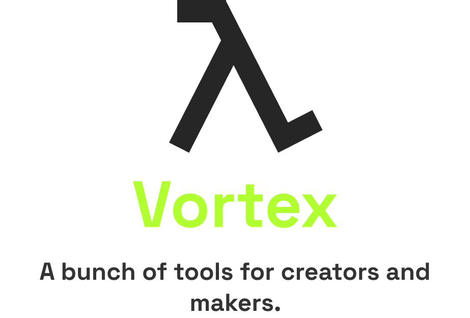
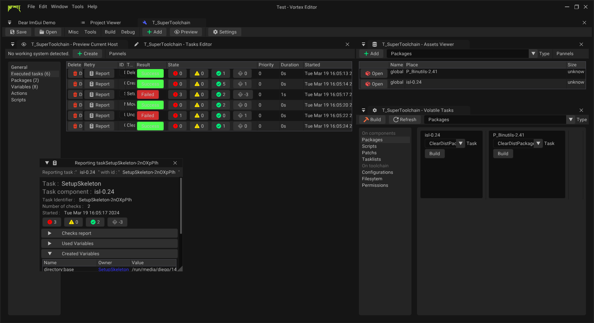

  




<p align="center">Vortex makes it easy to create a system, application or toolchain. It also offers a wide range of options for system maintenance and supervision. </p>


## General Features
- Operating systems creation tools
- Embedded systems creation tools
- Embedded apps creation tools
- Independant components creation tools (toolchains, packages, scripts, etc...)
- Pre/production & Post/Production tools
- Maintenance tools
- Update tools

### All Features 
- #### Projects
    - Project gestion & saves handle
    - Export to production
    - Easy collaboration
- ####  Toolchains
    - Toolchain development (manage packages, scripts and tasks)
    - Toolchain compilation
    - Toolchain debugging (gdb, testers, etc...)
- #### Hosts & Build Environments
    - Host development (packages, skeletons, routines, etc...)
    - Host compilation (from a toolchain for exemple)
    - Host linking and final components build
    - Host debugging runtime
- #### General Purpose Operating Systems (GPOS)
    - System development
    - 


- Operating Systems, Embedded Filesystems & Embbeded app creation
- Full toolchain creation
- Complete package & tarball creation
- Advanced snapshot/recovery of a project
- Production tools


## Build & Installation

#### Linux/Unix Build
```
git clone https://github.com/infiniteHQ/VortexMaker.git
cd VortexMaker
mkdir build && cd build
cmake ..
sudo make install
```


#### Linux Distributions
```
```

#### Windows
```
Download Release and run vortex_maker.exe (TODO)
```


## Usage
Usage : vortex <paramater(s)...> <information(s)...>

- -h --help :               See all parameters
- -g --gui :                Open the Vortex graphical interface
- -I --init  <...> :        Initialize a new project
- -i --install  <...> :     Install a new content
- -b --build <...> :        Build the project
- -a --add <...> :          Add a content (packages, libs, toolchains...)
- -p --preview <...> :      Preview final component(s) of the project


## Create your first operating system
##### Create your first project
For this example, let's initialize a project with a sample, such as a basic Linux operating system.

*vortex -cp \<project_name\> \<template\>*
```
vortex -cp MySystem linux_os
```
This command will create a system called *MySystem* based on *linux_os* template.


##### Develop your system...
First, enter your project with 

```
cd ./MySystem
```


Once inside, you can interact with it using various commands:

*Open the project editor*
```
vortex -g
```
or
```
vortex --gui
```

*Add a package into the project*
```
vortex -a package <path_to_your_package>
```

*Build all toolchains*
```
vortex -b toolchains
```

*Build all project*
```
vortex -b all
```
