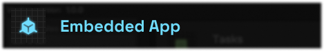
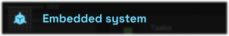
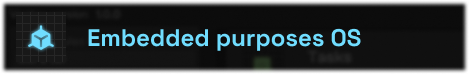

<a href="https://infinite.si">
  <h1 align="center">
    <picture>
      <source media="(prefers-color-scheme: dark)" srcset="./.github/imgs/main.png">
      
    </picture>
  </h1>
</a>

<div align="center">
<a title="Code Quality" href="https://www.codefactor.io/repository/github/infinitehq/Vortex"></a>
  <a title="Discord Server" href="https://discord.gg/H2wptkecUg"></a>
<a title="'Build' workflow Status" href="https://img.shields.io/github/actions/workflow/status/infiniteHQ/Vortex/build.yml"></a>
  <a title="Modules & Plugins" href=""></a>
</div>

## What is it ?
Vortex is a comprehensive open creation platform for creators and makers. The primary goal of this platform is to empower everyone to create systems, real-world apps, embedded applications, user environment apps, networking solutions, and more—while upholding the values of top-notch technology: security, safety, efficiency, and quality. This editor aims to provide users access to best practices and excellent tools.

## Allow everyone to make everythings

Transform your environment into a playground, a sandbox with Vortex. Master this environment to manipulate data, services, apps, etc. Turn the real world into a sandbox and shape it to your liking, regardless of the project.

## Features


With Vortex, create and collaborate on new or existing projects. You can simply create your project with the command **vortex -cp \<ProjectName>**, go into the project folder and execute the command **vortex -g**. (Why not create a project manager at the future.) And then, you can add modules/plugins in your project to make it as you want. You can also create or add assets and start a powerfull adventure !


This project was made for modularity and modifications, you can so add or remove all components you want, and adapt Vortex with your usecases and your problematics. Add modules to have dedicated featrures relative to what you want to create, you can have toolchains modules. You can also create your owns modules easely (check our template) and give it to the community for example ! :)


Vortex give you the possibility to create your own assets and components, you can so create all things you want (like toolchains, systems, apps, libs), and add it into your project.

## Quick installation
`NOTE: We actually work on the Windows support, stay tuned :)`

#### Install the core on Linux
```bash
git clone https://github.com/infiniteHQ/Vortex
cd Vortex
git submodule update --init --recursive
cd build/in_system/
bash ./build.sh
```

#### Install a module
```bash
cd path/to/a/module
bash ./build.sh
bash ./install.sh # or copy the folder on the .vx/modules of a project
```

## Quick start
#### Create a project
```bash
vortex -cp <ProjectName> # or --create-project
```

#### Open project
```bash
cd path/to/your/project/
vortex -g <Parameters> # or --gui
```

## Builtin modules/plugins

With builtin modules, you can develop embedded applications (for microcontrollers, etc.) is also an area of interest for Vortex. With its set of tools, it will now be easier to develop our future applications. Vortex builtin modules also allows the creation of various tools such as toolchains, packages, build hosts, scripts, deployment systems, maintenance, and update systems. 

Creating complete systems is now easy with Vortex. Imagine, develop, build, maintain, and update them with many tools to optimize the process and reduce the cost of development and production.


A toolchain is a collection of software tools used in the development process to translate source code into executable binaries, libraries, or firmware. It typically includes compilers, linkers, assemblers, debuggers, and libraries. The compiler translates high-level code into machine code, the linker combines multiple object files into executables, and the debugger helps identify and fix issues. For embedded systems, cross-compilers may be used to generate code for different architectures. Overall, a toolchain streamlines the software development process by automating tasks and ensuring compatibility across various platforms and environments.
**This module allow you to create custom-made toolchain(s)**


A package is a tarball that contain contents for a system. It can generate binaries, libraries, configurations or other things to a toolchain, a host build environment, a general purposes operating system or a embedded system. 


This module can create, manage, execute et report advances metrics of a task. The task is a simple fonction and it can be executed by this module on a task processor.


A tasklist can contain a group of tasks, and order it by priority, collect logs, gives generics arguments or components, or automate the process of executing tasks in a project.


#### Planned builtin modules
<div align="center">





</div>

## Special thanks

- The amazing immediate mode UI system "ImGui" from Ocornut (https://github.com/ocornut/imgui)

- The json library of nlohmann (https://github.com/nlohmann/json)

- The logger library of gabime (https://github.com/gabime/spdlog)
